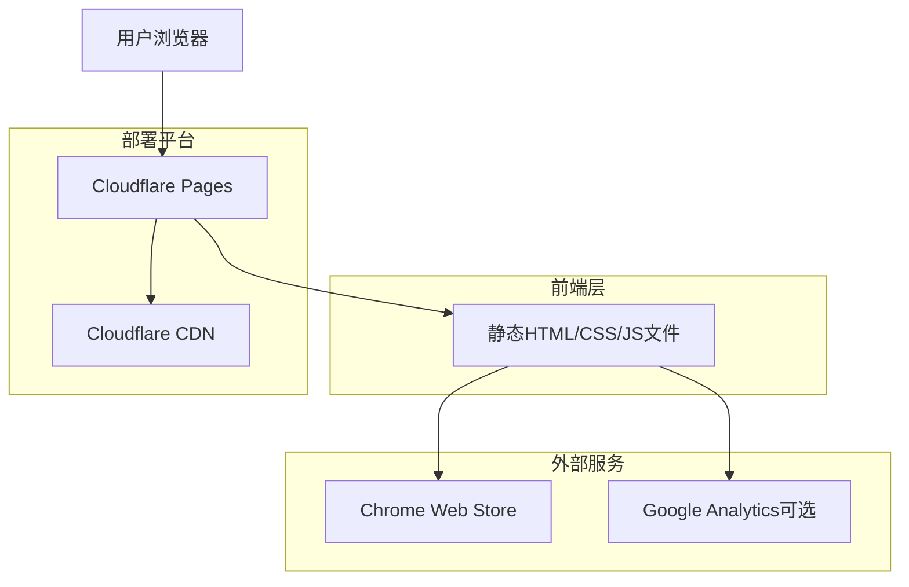

# TOTP Generator 官网技术架构文档

## 1. 架构设计



## 2. 技术描述

- 前端：HTML5 + CSS3 + Vanilla JavaScript
- 构建工具：无需构建工具，纯静态文件
- 部署平台：Cloudflare Pages
- CDN：Cloudflare 全球 CDN
- 域名：支持自定义域名

## 3. 路由定义

| 路由 | 用途 |
|------|------|
| / | 首页，展示产品介绍和下载链接 |
| /privacy | 隐私政策页面（可选） |
| /terms | 使用条款页面（可选） |

## 4. 文件结构

```
website/
├── index.html          # 主页面
├── styles/
│   ├── main.css       # 主样式文件
│   └── responsive.css # 响应式样式
├── scripts/
│   ├── main.js        # 主要交互逻辑
│   └── analytics.js   # 分析代码（可选）
├── images/
│   ├── hero-bg.jpg    # 英雄区背景图
│   ├── features/      # 功能特性图标
│   ├── screenshots/   # 产品截图
│   └── icons/         # 各种图标
├── favicon.ico        # 网站图标
└── _headers          # Cloudflare Pages 配置
```

## 5. 部署配置

### 5.1 Cloudflare Pages 配置

**构建设置：**
- 构建命令：无需构建
- 构建输出目录：/ （根目录）
- 根目录：website/

**环境变量：**
- NODE_VERSION: 18（如果需要）

### 5.2 性能优化

**图片优化：**
- 使用 WebP 格式，提供 JPEG/PNG 后备
- 响应式图片，支持不同分辨率
- 图片懒加载

**CSS/JS 优化：**
- CSS 压缩
- JavaScript 压缩
- 关键 CSS 内联
- 非关键资源延迟加载

**缓存策略：**
```
# _headers 文件内容
/*
  Cache-Control: public, max-age=31536000
  X-Frame-Options: DENY
  X-Content-Type-Options: nosniff
  Referrer-Policy: strict-origin-when-cross-origin

/*.html
  Cache-Control: public, max-age=3600

/*.css
  Cache-Control: public, max-age=31536000

/*.js
  Cache-Control: public, max-age=31536000

/*.jpg
  Cache-Control: public, max-age=31536000

/*.png
  Cache-Control: public, max-age=31536000

/*.webp
  Cache-Control: public, max-age=31536000
```

## 6. 安全配置

**内容安全策略 (CSP)：**
```
Content-Security-Policy: default-src 'self'; script-src 'self' 'unsafe-inline' https://www.googletagmanager.com; style-src 'self' 'unsafe-inline'; img-src 'self' data: https:; font-src 'self' https://fonts.gstatic.com; connect-src 'self' https://www.google-analytics.com;
```

**其他安全头：**
- X-Frame-Options: DENY
- X-Content-Type-Options: nosniff
- Referrer-Policy: strict-origin-when-cross-origin
- Permissions-Policy: camera=(), microphone=(), geolocation=()

## 7. 监控和分析

**可选集成：**
- Google Analytics 4（用户行为分析）
- Cloudflare Analytics（性能监控）
- Core Web Vitals 监控

**关键指标：**
- 页面加载时间
- 首次内容绘制 (FCP)
- 最大内容绘制 (LCP)
- 累积布局偏移 (CLS)
- 下载按钮点击率

## 8. SEO 优化

**基础 SEO：**
- 语义化 HTML 结构
- Meta 标签优化
- Open Graph 标签
- Twitter Card 标签
- 结构化数据 (JSON-LD)
- XML Sitemap
- robots.txt

**关键词策略：**
- TOTP Generator
- 双因素认证
- Chrome 扩展
- 二步验证
- 安全认证工具