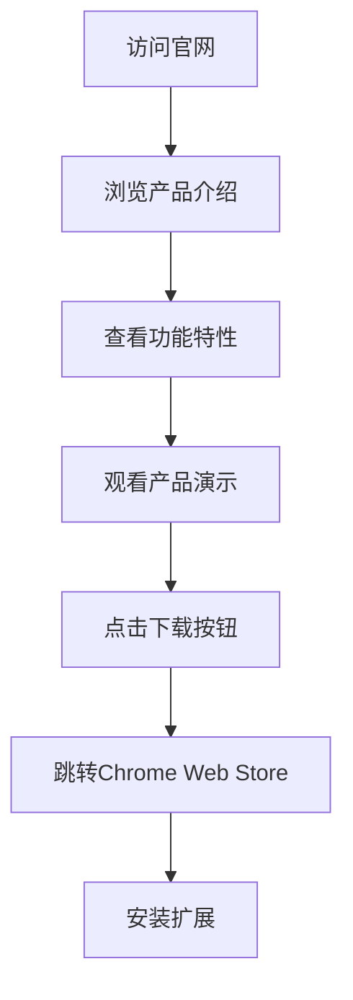

# TOTP Generator 官网首页产品需求文档

## 1. 产品概述

TOTP Generator 官网是一个现代化的单页面网站，用于展示和推广 TOTP Generator Chrome 扩展。该网站将突出扩展的安全性、易用性和专业性，帮助用户了解双因素认证的重要性并引导用户下载使用扩展。

网站将部署在 Cloudflare Pages 上，确保全球访问速度和稳定性。

## 2. 核心功能

### 2.1 用户角色

| 角色 | 访问方式 | 核心权限 |
|------|----------|----------|
| 访问者 | 直接访问网站 | 浏览网站内容、下载扩展 |

### 2.2 功能模块

我们的 TOTP Generator 官网包含以下主要页面：
1. **首页**：英雄区块、功能特性展示、下载引导、常见问题解答

### 2.3 页面详情

| 页面名称 | 模块名称 | 功能描述 |
|----------|----------|----------|
| 首页 | 英雄区块 | 展示产品标题、核心价值主张、主要行动按钮（下载扩展） |
| 首页 | 功能特性 | 展示扩展的6个核心功能：TOTP生成、可视化倒计时、本地存储、安全加密、一键复制、长按删除 |
| 首页 | 产品演示 | 通过截图或动画展示扩展的实际使用界面和操作流程 |
| 首页 | 安全保障 | 强调Web Crypto API加密、本地存储、无数据上传等安全特性 |
| 首页 | 下载安装 | 提供Chrome Web Store下载链接、安装步骤说明 |
| 首页 | 常见问题 | 回答用户关于TOTP、安全性、使用方法等常见问题 |
| 首页 | 页脚信息 | 版权信息、联系方式、相关链接 |

## 3. 核心流程

用户访问流程：
1. 用户访问官网首页
2. 浏览产品介绍和功能特性
3. 查看产品演示了解使用方法
4. 点击下载按钮跳转到Chrome Web Store
5. 安装扩展并开始使用

## 4. 用户界面设计

### 4.1 设计风格

- **主色调**：渐变蓝紫色 (#667eea 到 #764ba2)，体现科技感和安全感
- **辅助色**：白色 (#ffffff)、深灰色 (#2d3748)、浅灰色 (#f7fafc)
- **按钮风格**：圆角按钮，渐变背景，悬停效果
- **字体**：系统字体栈 (-apple-system, BlinkMacSystemFont, "Segoe UI", Roboto)
- **布局风格**：现代卡片式设计，大量留白，渐变背景
- **图标风格**：线性图标，简洁现代，与品牌色调一致

### 4.2 页面设计概览

| 页面名称 | 模块名称 | UI元素 |
|----------|----------|--------|
| 首页 | 英雄区块 | 大标题、副标题、主要CTA按钮、背景渐变、产品图标 |
| 首页 | 功能特性 | 3x2网格布局、图标+标题+描述、卡片式设计、悬停效果 |
| 首页 | 产品演示 | 扩展截图、操作步骤说明、动画效果 |
| 首页 | 安全保障 | 安全图标、信任标识、技术说明 |
| 首页 | 下载安装 | Chrome Web Store徽章、安装步骤、版本信息 |
| 首页 | 常见问题 | 折叠式问答、搜索功能、分类标签 |

### 4.3 响应式设计

网站采用移动优先的响应式设计：
- 桌面端：1200px+ 多列布局
- 平板端：768px-1199px 两列布局
- 移动端：<768px 单列布局
- 支持触摸交互优化
- 适配高分辨率屏幕